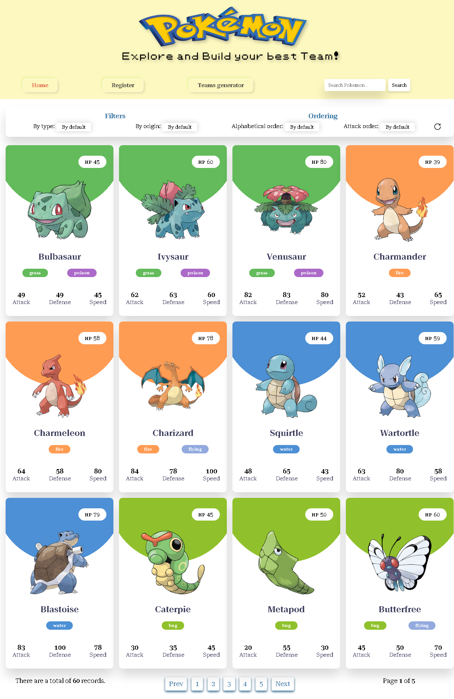

# App Pokemon

> Una aplicación para buscar pokemones y armar equipos

## Built With

- Javascript
- React
- Express
- NodeJS
- Redux
- Sequelize

## Live Demo

[Live Demo Link](https://pi-pokemon-front-rho.vercel.app)

## Authors

👤 **Daniel Yépez**

- GitHub: [@danielyepez13](https://github.com/danielyepez13)
- LinkedIn: [LinkedIn](https://www.linkedin.com/in/daniel-yepez/)

## 🤝 Contributing

Contributions, issues, and feature requests are welcome!

Feel free to check the [issues page](issues/).

## Show your support

Give a ⭐️ if you like this project!

## 📝 License

This project is [CC0 1.0 Universal](LICENSE) licensed.
